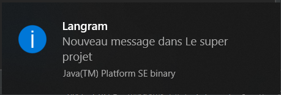

# Système de discussion en temps réel décentralisé

### Ce qui marche

* Gestion des échanges des messages one-to-one
* Gestion de l'identification des utilisateurs connectés
* Gestion des échanges des messages one-to-many
* Historisation des échanges
* Gestions des cas particuliers (multiples lancements de l'application sur une même machine, envoi d'un message à un utilisateur qui vient de se déconnecter)
* Notification par le système lorsqu'un message est reçu (cf plus bas)

### Phase de connexion

Le mot de passe ne sert pour l'instant à rien. Si vous vous connectez avec un pseudonyme déjà utilisé sur le réseau, vous aurez un message d'erreur. 

### Pour ajouter un projet

Saisir le nom du projet et l'adresse IP Multicast associée.

### Notification lors de la réception d'un message

### Affichage d'une conversation de groupe

Vue de Jacquie

Vue de Michel

### Affichage d'une conversation privée

