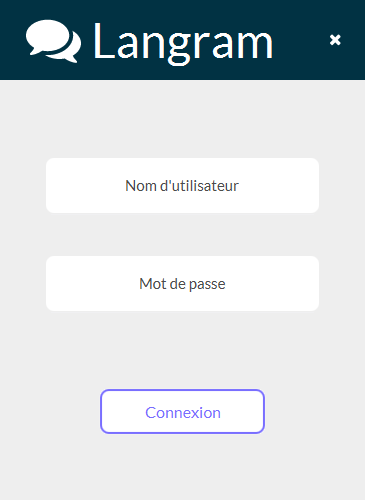
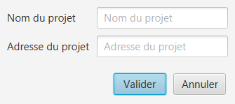
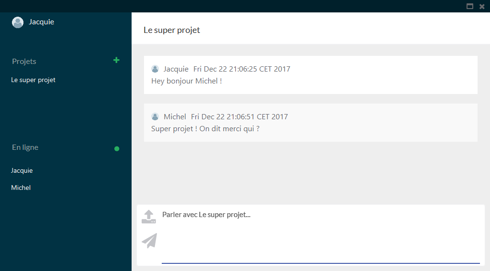
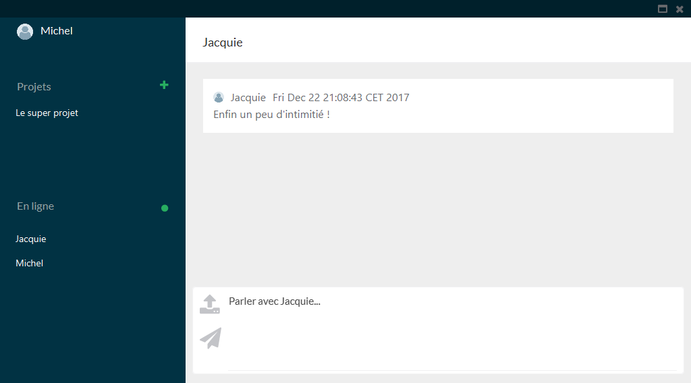

# Système de discussion en temps réel décentralisé

### Phase de connexion

Le mot de passe ne sert pour l'instant à rien. Si vous vous connectez avec un pseudonyme déjà utilisé sur le réseau, vous aurez un message d'erreur. 

### Pour ajouter un projet

Saisir le nom du projet et l'adresse IP Multicast associée.

### Affichage d'une conversation de groupe

Vue de Jacquie

Vue de Michel

### Affichage d'une conversation privée

